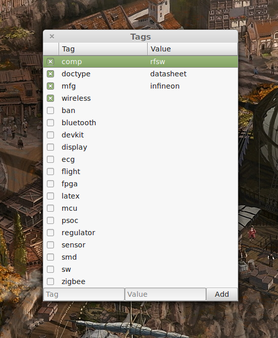

This is a small GUI interface for [tmsu](https://github.com/oniony/TMSU/) file
tagging utility. It's designed to be integrated into the Nemo file manager but
it should be usable with other tools as well.

### How it works?

Script expects a single file name as the sole argument. If a tmsu database is
detected, all file tags are listed. You can tag/untag the file. Add new/existing
tags by typing. You can add value tags as well. And you can change (rename) tags
and values.

Note: GUI won't allow you to have same tags with different values (which is
possible with command line tmsu), instead it will change the tag value.

### Installation for Nemo

Copy or link `tags.py` and `tags.nemo_action` files to the
`~/.local/share/nemo/actions`. Now you should have a new "Tag" menu item in the
file context menu.

### Dependencies

- tmsu
- python3
- Gtk3 gir bindings
